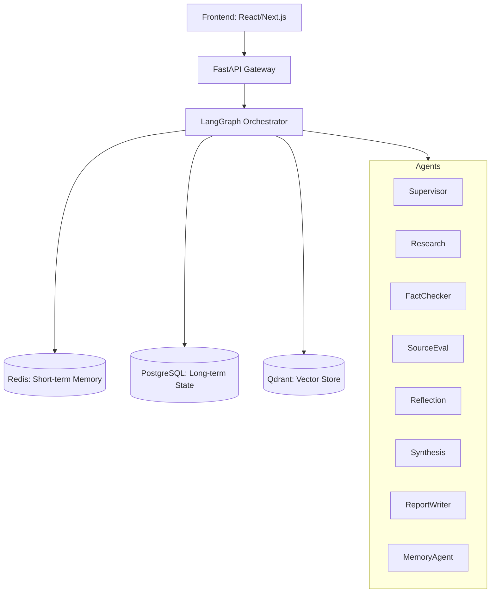
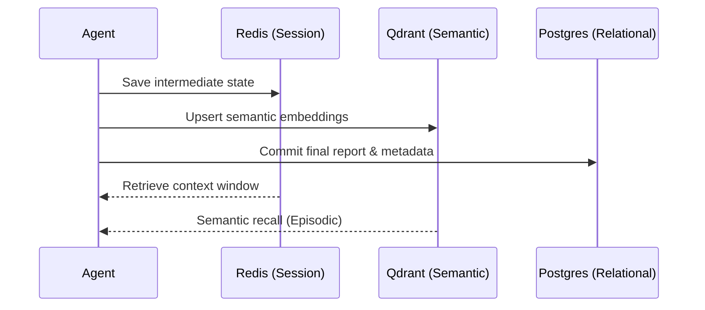
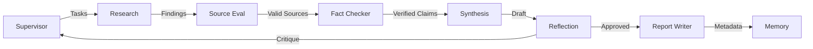

# ARAMS: AI Research and Analysis Management System
## Production Build Guide & Architectural Specification
**Version:** 1.0.0  
**Brand:** Scandium Labs  
**Date:** June 10, 2026

---

## 1. System Architecture

### 1.1 Component Layout & Data Flow


### 1.2 Memory Flow


### 1.3 Agent Communication (Handoffs)


---

## 2. Agent Design Specifications (Full)

### 2.1 Supervisor Agent
- **Goal:** Task decomposition and routing.
- **Inputs:** User query, past session memory.
- **Outputs:** List of `Task` objects.
- **Prompt Template:** 
  ```text
  You are the Lead Architect. Break the query "{query}" into atomic tasks.
  Consider these previous context items: {memory}.
  Output format: JSON list of {id, description, dependency_ids}.
  ```
- **Code Snippet:**
  ```python
  def supervisor_node(state: AgentState):
      tasks = llm.invoke(supervisor_prompt.format(query=state['query']))
      return {"tasks": tasks}
  ```

### 2.2 Research Agent
- **Goal:** Deep web search and snippet extraction.
- **Inputs:** Task description.
- **Outputs:** List of `Finding` objects (snippet, URL, title).
- **Prompt Template:** 
  ```text
  Search for detailed information on: {task}. 
  Extract technical specs, dates, and direct quotes.
  ```
- **Code Snippet:**
  ```python
  def research_node(state: AgentState):
      query = state['tasks'][0].description
      results = tavily.search(query)
      return {"findings": results}
  ```

### 2.3 Fact Checking Agent
- **Goal:** Hallucination detection.
- **Inputs:** Findings, Claims.
- **Outputs:** Verification status (Verified/Refuted/Uncertain).
- **Prompt:** "Compare claim {claim} against these sources: {findings}. Flag contradictions."
- **Code:** `def fact_checker(state): return {"verified": llm.invoke(prompt)}`

### 2.4 Source Evaluation Agent
- **Goal:** Scoring sources (0.0 - 1.0).
- **Inputs:** URLs, Metadata.
- **Outputs:** `reliability_score`.
- **Logic:** Heuristic-based scoring + LLM credibility check.

### 2.5 Reflection Agent
- **Goal:** Identify logical fallacies or missing evidence.
- **Inputs:** Synthesis Draft.
- **Outputs:** Critique/Approval.
- **Prompt:** "Act as a peer reviewer. What is missing in this report?"

### 2.6 Synthesis Agent
- **Goal:** Multi-perspective aggregation.
- **Inputs:** Verified Findings.
- **Outputs:** Coherent Markdown draft.

### 2.7 Report Writer Agent
- **Goal:** Final formatting in LaTeX or Markdown with full citations.
- **Inputs:** Synthesis Draft.
- **Outputs:** Final `.md` or `.pdf`.

### 2.8 Memory Agent
- **Goal:** Entity/Relation extraction for Knowledge Graph.
- **Inputs:** Final Report.
- **Outputs:** Triples `(subject, predicate, object)`.

---

## 3. LangGraph Implementation (Advanced)

### 3.1 Retry Logic with Tenacity
```python
from tenacity import retry, stop_after_attempt, wait_exponential

@retry(stop=stop_after_attempt(3), wait=wait_exponential(multiplier=1, min=4, max=10))
def call_llm_with_retry(prompt):
    return llm.invoke(prompt)
```

### 3.2 Human-in-the-Loop Routing
```python
def human_review_logic(state: AgentState):
    if state['iteration_count'] > 5:
        return "human_intervention"
    return "synthesis"

workflow.add_node("human_intervention", human_input_node)
```

### 3.3 Parallel Async Execution
```python
import asyncio

async def parallel_research(tasks):
    return await asyncio.gather(*[research_node(t) for t in tasks])
```

---

## 4. RAG Pipeline

- **Chunking:** Semantic chunking using `RecursiveCharacterTextSplitter` with 1024 token window.
- **Retrieval:** Hybrid Search (BM25 + Vector Similarity).
- **Reranking:** Cohere Rerank v3 for top-K optimization.
- **Contextual Compression:** Removing redundant tokens before LLM injection.

---

## 5. Memory System

| Layer | Technology | Purpose |
| :--- | :--- | :--- |
| **Short-term** | Redis | Current session state, TTL 24h. |
| **Long-term** | PostgreSQL | Relational data: users, history, full reports. |
| **Episodic** | Qdrant | Vectorized past insights for semantic recall. |

---

## 6. Search & Tools Integration

- **Tavily:** Primary web search for real-time data.
- **Firecrawl:** URL-to-Markdown conversion for deep scraping.
- **ArXiv:** Academic paper retrieval.
- **Deduplication:** Cosine similarity check on retrieved snippets (Threshold: 0.85).

---

## 7. Fact Verification Logic

1. **Claim Extraction:** LLM identifies atomic claims in research text.
2. **Multi-Source Check:** Search for each claim independently.
3. **Confidence Scoring:** 
   - 3+ sources: High (0.95)
   - 1 source: Low (0.30)
   - Contradiction: Flag for human review.

---

## 8. Database Schema (PostgreSQL)

```sql
CREATE TABLE users (
    id UUID PRIMARY KEY DEFAULT gen_random_uuid(),
    email VARCHAR(255) UNIQUE NOT NULL,
    created_at TIMESTAMP DEFAULT NOW()
);

CREATE TABLE sessions (
    id UUID PRIMARY KEY DEFAULT gen_random_uuid(),
    user_id UUID REFERENCES users(id),
    started_at TIMESTAMP DEFAULT NOW()
);

CREATE TABLE tasks (
    id UUID PRIMARY KEY,
    session_id UUID REFERENCES sessions(id),
    description TEXT,
    status VARCHAR(50) -- 'pending', 'running', 'completed'
);

CREATE TABLE agent_logs (
    id SERIAL PRIMARY KEY,
    task_id UUID REFERENCES tasks(id),
    agent_name VARCHAR(50),
    log_content JSONB,
    created_at TIMESTAMP DEFAULT NOW()
);

CREATE TABLE reports (
    id UUID PRIMARY KEY DEFAULT gen_random_uuid(),
    session_id UUID REFERENCES sessions(id),
    title TEXT,
    content TEXT,
    metadata JSONB,
    created_at TIMESTAMP DEFAULT NOW()
);
```

---

## 9. API Endpoints (FastAPI)

- `POST /v1/research/start`: Trigger new research task.
- `GET /v1/research/status/{id}`: Poll progress.
- `GET /v1/reports/{id}`: Fetch final report.
- `WS /v1/stream`: Real-time agent log streaming.

---

## 10. Deployment & CI/CD

### 10.1 Docker Compose (Local)
```yaml
services:
  api:
    build: .
    ports: ["8000:8000"]
  redis:
    image: redis:alpine
  qdrant:
    image: qdrant/qdrant
```

### 10.2 Kubernetes
- Use **Helm** for managing microservices.
- **HPA** (Horizontal Pod Autoscaler) based on CPU/Memory for the Agent workers.

### 10.3 GitHub Actions CI/CD
```yaml
name: Deploy ARAMS
on: [push]
jobs:
  build-and-deploy:
    runs-on: ubuntu-latest
    steps:
      - uses: actions/checkout@v2
      - name: Docker Build
        run: docker build -t gcr.io/scandium/arams-api .
      - name: Deploy to GKE
        run: kubectl apply -f k8s/
```

### 10.4 Monitoring (Prometheus/Grafana)
```yaml
# prometheus.yml
scrape_configs:
  - job_name: 'arams-api'
    static_configs:
      - targets: ['api:8000']
```

---

## 11. Cost & Resource Estimation

| Daily Users | Model Route | Est. Monthly Cost |
| :--- | :--- | :--- |
| 100 | GPT-4o / Claude 3.5 | $450 |
| 1,000 | Hybrid (GPT-4o + Llama 3 70B) | $3,800 |
| 10,000 | On-prem vLLM (H100 Cluster) | $25,000+ |

---

*This guide is proprietary to Scandium Labs. Unauthorized distribution is prohibited.*
