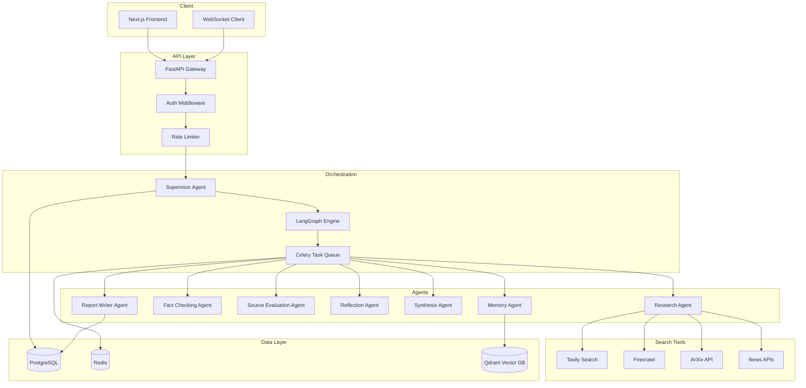
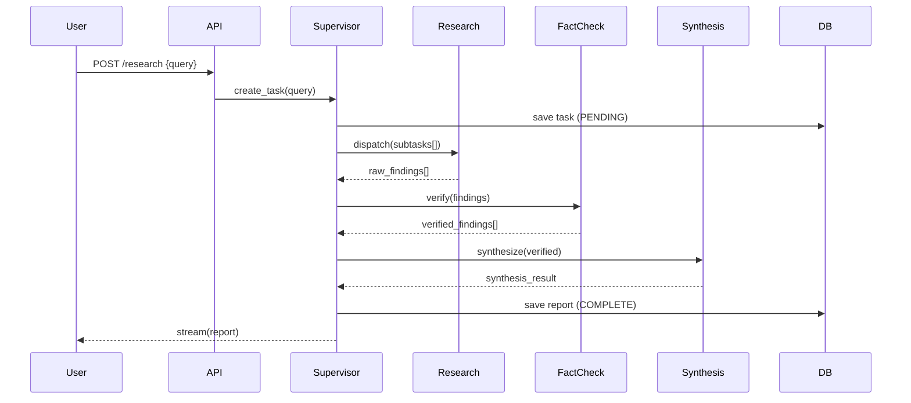
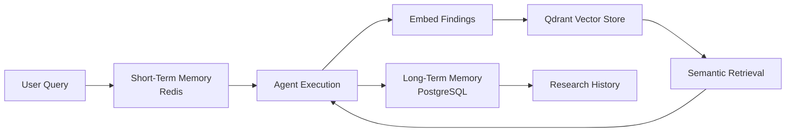

# Autonomous Multi-Agent Research System
## End-to-End Build Guide

**Author:** Shamique Khan | Scandium Labs  
**Stack:** Python · FastAPI · LangGraph · LangChain · OpenAI · PostgreSQL · Redis · Docker · Kubernetes

---

## Table of Contents

1. [System Overview](#1-system-overview)
2. [High-Level Architecture](#2-high-level-architecture)
3. [Agent Design](#3-agent-design)
4. [LangGraph Implementation](#4-langgraph-implementation)
5. [RAG System Design](#5-rag-system-design)
6. [Memory Architecture](#6-memory-architecture)
7. [Search Infrastructure](#7-search-infrastructure)
8. [Fact Verification System](#8-fact-verification-system)
9. [Database Design](#9-database-design)
10. [API Design](#10-api-design)
11. [Frontend Architecture](#11-frontend-architecture)
12. [Deployment](#12-deployment)
13. [Security](#13-security)
14. [Cost Optimization](#14-cost-optimization)
15. [Production Folder Structure](#15-production-folder-structure)
16. [Complete Code Skeleton](#16-complete-code-skeleton)
17. [Scaling Strategy](#17-scaling-strategy)
18. [Future Improvements](#18-future-improvements)

---

## 1. System Overview

The Autonomous Multi-Agent Research System (AMARS) is a production-grade AI platform that accepts a natural language research query and autonomously plans, executes, verifies, synthesizes, and reports research findings — operating like a team of senior research analysts working in parallel.

### Core Capabilities

- Multi-agent orchestration via LangGraph stateful graphs
- Web search, paper retrieval, and browser automation
- Iterative reflection loops with gap detection
- Hallucination detection and multi-source fact verification
- Long-term memory with semantic retrieval via vector database
- Streaming real-time progress to the frontend
- Human-in-the-loop review before final report generation

### Research Flow Summary

```
User Query
    ↓
Task Planning (Supervisor)
    ↓
Parallel Research Execution
    ↓
Source Collection + Evaluation
    ↓
Fact Verification
    ↓
Reflection Loop (Gap Detection)
    ↓
Additional Targeted Research
    ↓
Synthesis
    ↓
Report Generation
    ↓
Human Review
    ↓
Final Output
```

---

## 2. High-Level Architecture

### Component Diagram



### Data Flow



### Memory Flow



---

## 3. Agent Design

### 3.1 Supervisor Agent

**Goal:** Decompose the user query into subtasks, route them to specialized agents, and coordinate the end-to-end workflow.

**Inputs:** Raw user query, session context  
**Outputs:** Task plan, agent assignments, final workflow state

**Prompt Template:**
```
You are the Supervisor of an autonomous research system.

Given the research query: {query}

Your responsibilities:
1. Break the query into 3-7 focused research subtasks
2. Assign each subtask to the most appropriate agent
3. Determine which tasks can run in parallel
4. Monitor progress and handle failures
5. Trigger reflection if research gaps are detected

Output a structured JSON plan:
{
  "subtasks": [...],
  "parallel_groups": [...],
  "priority": "high|medium|low",
  "estimated_depth": "shallow|medium|deep"
}
```

**LangGraph Node:**
```python
def supervisor_node(state: ResearchState) -> ResearchState:
    response = llm.invoke(supervisor_prompt.format(
        query=state["query"],
        history=state["memory"]
    ))
    plan = parse_json(response)
    state["task_plan"] = plan
    state["status"] = "planning_complete"
    return state
```

---

### 3.2 Research Agent

**Goal:** Execute targeted web searches, extract relevant information, and return structured findings.

**Inputs:** Subtask description, search keywords, depth level  
**Outputs:** Raw findings with source URLs and relevance scores

**Tools:** Tavily, Firecrawl, ArXiv, Semantic Scholar, News APIs

**Prompt Template:**
```
You are a Research Agent. Your task: {subtask}

Search Strategy:
- Use provided tools to find high-quality sources
- Prioritize peer-reviewed papers, official docs, reputable news
- Extract key claims, data points, and supporting evidence
- Return findings with source URLs and confidence scores

Context from memory: {memory_context}

Output structured findings as JSON.
```

**Memory Strategy:** Stores search results in Redis (TTL: 1 hour). Embeds findings into Qdrant for cross-session retrieval.

---

### 3.3 Fact Checking Agent

**Goal:** Verify claims from Research Agent against multiple independent sources.

**Inputs:** List of claims with source URLs  
**Outputs:** Verified claims with confidence scores and contradiction flags

**Prompt Template:**
```
You are a Fact Checking Agent.

Claim to verify: {claim}
Original source: {source}

Steps:
1. Search for 2-3 independent sources confirming or denying the claim
2. Check for contradictions across sources
3. Assign a confidence score (0.0 - 1.0)
4. Flag if hallucination or contradiction detected

Output: {verified: bool, confidence: float, contradictions: [], sources: []}
```

---

### 3.4 Source Evaluation Agent

**Goal:** Score sources for credibility, domain authority, and recency.

**Inputs:** List of URLs with domain metadata  
**Outputs:** Scored source list, ranked by trust

**Scoring Algorithm:**
```python
def score_source(url: str, domain: str, date: str) -> float:
    base_score = DOMAIN_TRUST.get(domain, 0.5)
    recency_penalty = max(0, 1 - (days_old(date) / 365) * 0.3)
    https_bonus = 0.1 if url.startswith("https") else 0
    academic_bonus = 0.2 if domain in ACADEMIC_DOMAINS else 0
    return min(1.0, base_score * recency_penalty + https_bonus + academic_bonus)
```

---

### 3.5 Reflection Agent

**Goal:** Identify gaps in research coverage and generate targeted follow-up questions.

**Inputs:** Current research findings, original query  
**Outputs:** Gap report, new research questions, continue/stop signal

**Stopping Criteria:**
- Confidence threshold reached (>0.85)
- Max iterations reached (default: 3)
- No new gaps detected
- Token budget exhausted

**Prompt Template:**
```
You are a Reflection Agent reviewing research completeness.

Original query: {query}
Current findings summary: {summary}
Research iterations so far: {iteration_count}

Evaluate:
1. What aspects of the query are still unanswered?
2. Are there contradictions that need resolution?
3. Are there important subtopics not yet covered?

Output:
{
  "gaps": [...],
  "new_questions": [...],
  "should_continue": bool,
  "confidence_score": float
}
```

---

### 3.6 Synthesis Agent

**Goal:** Merge findings from all research threads into a coherent, deduplicated knowledge base.

**Inputs:** All verified findings from multiple research passes  
**Outputs:** Synthesized insights, key conclusions, evidence map

**Prompt Template:**
```
You are a Synthesis Agent.

You have received findings from multiple research agents:
{all_findings}

Your task:
1. Identify common themes and patterns
2. Resolve contradictions with evidence weighting
3. Generate 5-10 key insights
4. Map evidence to conclusions
5. Prepare structured data for the Report Writer

Output a synthesis JSON with insights, evidence_map, and conclusion.
```

---

### 3.7 Report Writer Agent

**Goal:** Produce a final, well-cited, executive-quality research report.

**Inputs:** Synthesis output, citation list, user preferences  
**Outputs:** Full markdown report with executive summary, sections, citations

**Prompt Template:**
```
You are a Report Writer Agent producing a professional research report.

Synthesis data: {synthesis}
Citations: {citations}
Report format preference: {format}

Generate a complete report with:
- Executive Summary (3-5 sentences)
- Key Findings (numbered list)
- Detailed Analysis (section per major theme)
- Limitations and Caveats
- Recommendations
- References (APA or IEEE format)

Use clear headings, avoid jargon, cite every factual claim.
```

---

### 3.8 Memory Agent

**Goal:** Persist research findings to long-term storage and retrieve relevant context for new queries.

**Inputs:** New findings, user query, session ID  
**Outputs:** Retrieved memory context, storage confirmation

**Storage Strategy:**
- Short-term: Redis hash by session_id (TTL: 2 hours)
- Long-term: PostgreSQL `research_memory` table
- Semantic: Qdrant collection `research_embeddings`

---

## 4. LangGraph Implementation

### State Schema

```python
from typing import TypedDict, List, Optional, Dict, Any
from langgraph.graph import StateGraph, END

class ResearchState(TypedDict):
    # Core
    query: str
    session_id: str
    task_id: str

    # Planning
    task_plan: Optional[Dict]
    subtasks: List[Dict]

    # Research
    raw_findings: List[Dict]
    verified_findings: List[Dict]
    source_scores: Dict[str, float]

    # Reflection
    gaps: List[str]
    new_questions: List[str]
    iteration_count: int
    should_continue: bool
    confidence_score: float

    # Output
    synthesis: Optional[Dict]
    report: Optional[str]
    citations: List[Dict]

    # Meta
    status: str
    error: Optional[str]
    memory: List[Dict]
    human_approved: bool
```

### Graph Definition

```python
from langgraph.graph import StateGraph, END

def build_research_graph() -> StateGraph:
    graph = StateGraph(ResearchState)

    # Add nodes
    graph.add_node("supervisor", supervisor_node)
    graph.add_node("research", research_node)
    graph.add_node("fact_check", fact_check_node)
    graph.add_node("source_eval", source_eval_node)
    graph.add_node("reflection", reflection_node)
    graph.add_node("synthesis", synthesis_node)
    graph.add_node("report_writer", report_writer_node)
    graph.add_node("human_review", human_review_node)
    graph.add_node("memory_save", memory_save_node)

    # Entry point
    graph.set_entry_point("supervisor")

    # Edges
    graph.add_edge("supervisor", "research")
    graph.add_edge("research", "source_eval")
    graph.add_edge("source_eval", "fact_check")
    graph.add_edge("fact_check", "reflection")

    # Conditional: continue research or proceed to synthesis
    graph.add_conditional_edges(
        "reflection",
        should_continue_research,
        {
            "continue": "research",
            "synthesize": "synthesis"
        }
    )

    graph.add_edge("synthesis", "report_writer")
    graph.add_edge("report_writer", "human_review")

    # Conditional: human approved or needs revision
    graph.add_conditional_edges(
        "human_review",
        check_human_approval,
        {
            "approved": "memory_save",
            "revise": "report_writer"
        }
    )

    graph.add_edge("memory_save", END)

    return graph.compile()


def should_continue_research(state: ResearchState) -> str:
    if (state["should_continue"] and
        state["iteration_count"] < 3 and
        state["confidence_score"] < 0.85):
        return "continue"
    return "synthesize"


def check_human_approval(state: ResearchState) -> str:
    return "approved" if state["human_approved"] else "revise"
```

### Parallel Research Execution

```python
import asyncio
from langgraph.graph import Send

async def research_node(state: ResearchState) -> ResearchState:
    subtasks = state["subtasks"]

    # Fan out to parallel research coroutines
    tasks = [run_research_subtask(st) for st in subtasks]
    results = await asyncio.gather(*tasks, return_exceptions=True)

    findings = []
    for r in results:
        if isinstance(r, Exception):
            continue  # log and skip failed subtasks
        findings.extend(r)

    state["raw_findings"] = findings
    state["iteration_count"] = state.get("iteration_count", 0) + 1
    return state
```

### Retry Logic

```python
from tenacity import retry, stop_after_attempt, wait_exponential

@retry(
    stop=stop_after_attempt(3),
    wait=wait_exponential(multiplier=1, min=2, max=10)
)
async def run_research_subtask(subtask: Dict) -> List[Dict]:
    agent = ResearchAgent()
    return await agent.run(subtask)
```

---

## 5. RAG System Design

### Document Pipeline

```
Web Page / PDF / Paper
    ↓
Crawl (Firecrawl / BeautifulSoup)
    ↓
Parse + Clean (remove boilerplate, ads, navigation)
    ↓
Chunk (RecursiveCharacterTextSplitter, 512 tokens, 64 overlap)
    ↓
Embed (text-embedding-3-large, 3072 dims)
    ↓
Store (Qdrant collection: research_docs)
```

### Chunking Strategy

```python
from langchain.text_splitter import RecursiveCharacterTextSplitter

splitter = RecursiveCharacterTextSplitter(
    chunk_size=512,
    chunk_overlap=64,
    separators=["\n\n", "\n", ". ", " ", ""]
)

def chunk_document(text: str, metadata: dict) -> List[Document]:
    chunks = splitter.split_text(text)
    return [
        Document(page_content=c, metadata={**metadata, "chunk_index": i})
        for i, c in enumerate(chunks)
    ]
```

### Retrieval Pipeline

```python
from langchain_openai import OpenAIEmbeddings
from langchain_qdrant import QdrantVectorStore
from langchain.retrievers import ContextualCompressionRetriever
from langchain.retrievers.document_compressors import LLMChainExtractor

embeddings = OpenAIEmbeddings(model="text-embedding-3-large")
vectorstore = QdrantVectorStore.from_existing_collection(
    embedding=embeddings,
    collection_name="research_docs",
    url=settings.QDRANT_URL
)

# Hybrid search: dense + sparse
retriever = vectorstore.as_retriever(
    search_type="mmr",  # Max Marginal Relevance for diversity
    search_kwargs={"k": 10, "fetch_k": 30, "lambda_mult": 0.7}
)

# Contextual compression to remove irrelevant passages
compressor = LLMChainExtractor.from_llm(llm)
compressed_retriever = ContextualCompressionRetriever(
    base_compressor=compressor,
    base_retriever=retriever
)
```

### Query Expansion

```python
def expand_query(query: str) -> List[str]:
    response = llm.invoke(f"""
    Generate 3 alternative phrasings for this research query.
    Original: {query}
    Output only a JSON list of strings.
    """)
    variants = json.loads(response.content)
    return [query] + variants
```

---

## 6. Memory Architecture

### Short-Term Memory (Redis)

```python
import redis
import json

class ShortTermMemory:
    def __init__(self):
        self.client = redis.Redis.from_url(settings.REDIS_URL)
        self.ttl = 7200  # 2 hours

    def save(self, session_id: str, key: str, value: Any):
        self.client.hset(f"session:{session_id}", key, json.dumps(value))
        self.client.expire(f"session:{session_id}", self.ttl)

    def get(self, session_id: str, key: str) -> Any:
        val = self.client.hget(f"session:{session_id}", key)
        return json.loads(val) if val else None

    def get_all(self, session_id: str) -> Dict:
        data = self.client.hgetall(f"session:{session_id}")
        return {k.decode(): json.loads(v) for k, v in data.items()}
```

### Long-Term Memory (PostgreSQL)

```sql
CREATE TABLE research_memory (
    id UUID PRIMARY KEY DEFAULT gen_random_uuid(),
    user_id UUID REFERENCES users(id),
    query TEXT NOT NULL,
    summary TEXT,
    key_insights JSONB,
    source_urls TEXT[],
    embedding_ids TEXT[],
    created_at TIMESTAMPTZ DEFAULT NOW()
);

CREATE INDEX idx_memory_user ON research_memory(user_id);
CREATE INDEX idx_memory_created ON research_memory(created_at DESC);
```

### Episodic Memory (Qdrant)

```python
from qdrant_client import QdrantClient
from qdrant_client.models import Distance, VectorParams, PointStruct

class EpisodicMemory:
    def __init__(self):
        self.client = QdrantClient(url=settings.QDRANT_URL)
        self.collection = "research_memory"

    def store(self, memory_id: str, text: str, metadata: dict):
        embedding = embed(text)
        self.client.upsert(
            collection_name=self.collection,
            points=[PointStruct(
                id=memory_id,
                vector=embedding,
                payload=metadata
            )]
        )

    def retrieve(self, query: str, top_k: int = 5) -> List[Dict]:
        embedding = embed(query)
        results = self.client.search(
            collection_name=self.collection,
            query_vector=embedding,
            limit=top_k
        )
        return [r.payload for r in results]
```

---

## 7. Search Infrastructure

### Tavily Integration

```python
from tavily import TavilyClient

class TavilySearchTool:
    def __init__(self):
        self.client = TavilyClient(api_key=settings.TAVILY_API_KEY)

    async def search(self, query: str, depth: str = "advanced") -> List[Dict]:
        response = self.client.search(
            query=query,
            search_depth=depth,
            max_results=10,
            include_answer=True,
            include_raw_content=True
        )
        return self._parse_results(response)

    def _parse_results(self, response) -> List[Dict]:
        return [{
            "title": r["title"],
            "url": r["url"],
            "content": r["content"],
            "score": r.get("score", 0.5),
            "published_date": r.get("published_date")
        } for r in response.get("results", [])]
```

### Firecrawl Integration

```python
from firecrawl import FirecrawlApp

class FirecrawlTool:
    def __init__(self):
        self.app = FirecrawlApp(api_key=settings.FIRECRAWL_API_KEY)

    async def scrape(self, url: str) -> Dict:
        result = self.app.scrape_url(
            url,
            params={"formats": ["markdown", "html"]}
        )
        return {
            "url": url,
            "content": result.get("markdown", ""),
            "metadata": result.get("metadata", {})
        }

    async def crawl(self, url: str, max_pages: int = 5) -> List[Dict]:
        result = self.app.crawl_url(url, params={"limit": max_pages})
        return result.get("data", [])
```

### ArXiv Integration

```python
import arxiv

class ArXivTool:
    async def search(self, query: str, max_results: int = 5) -> List[Dict]:
        client = arxiv.Client()
        search = arxiv.Search(
            query=query,
            max_results=max_results,
            sort_by=arxiv.SortCriterion.Relevance
        )
        results = []
        for paper in client.results(search):
            results.append({
                "title": paper.title,
                "authors": [a.name for a in paper.authors],
                "abstract": paper.summary,
                "url": paper.entry_id,
                "published": str(paper.published),
                "source": "arxiv"
            })
        return results
```

### Source Deduplication

```python
from sklearn.metrics.pairwise import cosine_similarity

def deduplicate_sources(sources: List[Dict], threshold: float = 0.92) -> List[Dict]:
    if not sources:
        return []
    embeddings = embed_batch([s["content"][:500] for s in sources])
    keep = [0]
    for i in range(1, len(sources)):
        sims = cosine_similarity([embeddings[i]], [embeddings[j] for j in keep])[0]
        if max(sims) < threshold:
            keep.append(i)
    return [sources[i] for i in keep]
```

---

## 8. Fact Verification System

### Multi-Source Validation

```python
class FactVerificationSystem:
    async def verify_claim(self, claim: str, original_source: str) -> Dict:
        # Search for corroborating sources
        search_results = await self.tavily.search(
            f'verify: "{claim}"', depth="advanced"
        )

        supporting = []
        contradicting = []

        for result in search_results[:5]:
            if result["url"] == original_source:
                continue
            verdict = await self._check_alignment(claim, result["content"])
            if verdict["supports"]:
                supporting.append(result)
            elif verdict["contradicts"]:
                contradicting.append(result)

        confidence = self._calculate_confidence(supporting, contradicting)

        return {
            "claim": claim,
            "verified": confidence > 0.6,
            "confidence": confidence,
            "supporting_sources": supporting,
            "contradicting_sources": contradicting,
            "hallucination_flag": len(supporting) == 0 and len(contradicting) > 2
        }

    def _calculate_confidence(self, supporting: List, contradicting: List) -> float:
        if not supporting and not contradicting:
            return 0.5  # Unverifiable
        total = len(supporting) + len(contradicting)
        base = len(supporting) / total
        # Weight by source credibility
        weighted = sum(s.get("score", 0.5) for s in supporting)
        return min(1.0, (base + weighted / (total * 2)) / 1.5)
```

### Hallucination Detection

```python
async def detect_hallucination(self, claim: str, context: str) -> bool:
    prompt = f"""
    Does this claim appear to be supported by the context?
    Claim: {claim}
    Context: {context[:1000]}
    
    Answer only: SUPPORTED or HALLUCINATION
    """
    response = await llm.ainvoke(prompt)
    return "HALLUCINATION" in response.content.upper()
```

---

## 9. Database Design

### PostgreSQL Schemas

```sql
-- Users
CREATE TABLE users (
    id UUID PRIMARY KEY DEFAULT gen_random_uuid(),
    email TEXT UNIQUE NOT NULL,
    hashed_password TEXT NOT NULL,
    full_name TEXT,
    tier TEXT DEFAULT 'free',
    created_at TIMESTAMPTZ DEFAULT NOW(),
    updated_at TIMESTAMPTZ DEFAULT NOW()
);

-- Sessions
CREATE TABLE sessions (
    id UUID PRIMARY KEY DEFAULT gen_random_uuid(),
    user_id UUID REFERENCES users(id) ON DELETE CASCADE,
    token TEXT UNIQUE NOT NULL,
    expires_at TIMESTAMPTZ NOT NULL,
    created_at TIMESTAMPTZ DEFAULT NOW()
);

-- Research Tasks
CREATE TABLE research_tasks (
    id UUID PRIMARY KEY DEFAULT gen_random_uuid(),
    user_id UUID REFERENCES users(id),
    query TEXT NOT NULL,
    status TEXT DEFAULT 'pending',  -- pending, running, complete, failed
    task_plan JSONB,
    iteration_count INT DEFAULT 0,
    confidence_score FLOAT,
    error_message TEXT,
    created_at TIMESTAMPTZ DEFAULT NOW(),
    completed_at TIMESTAMPTZ
);

CREATE INDEX idx_tasks_user ON research_tasks(user_id);
CREATE INDEX idx_tasks_status ON research_tasks(status);

-- Research Results
CREATE TABLE research_results (
    id UUID PRIMARY KEY DEFAULT gen_random_uuid(),
    task_id UUID REFERENCES research_tasks(id),
    agent_name TEXT NOT NULL,
    subtask TEXT,
    findings JSONB,
    verified BOOLEAN DEFAULT FALSE,
    confidence FLOAT,
    created_at TIMESTAMPTZ DEFAULT NOW()
);

-- Sources
CREATE TABLE sources (
    id UUID PRIMARY KEY DEFAULT gen_random_uuid(),
    task_id UUID REFERENCES research_tasks(id),
    url TEXT NOT NULL,
    title TEXT,
    domain TEXT,
    trust_score FLOAT,
    published_date DATE,
    content_hash TEXT,
    created_at TIMESTAMPTZ DEFAULT NOW()
);

CREATE INDEX idx_sources_task ON sources(task_id);

-- Reports
CREATE TABLE reports (
    id UUID PRIMARY KEY DEFAULT gen_random_uuid(),
    task_id UUID REFERENCES research_tasks(id) UNIQUE,
    user_id UUID REFERENCES users(id),
    title TEXT,
    executive_summary TEXT,
    full_content TEXT NOT NULL,
    citations JSONB,
    word_count INT,
    human_approved BOOLEAN DEFAULT FALSE,
    approved_at TIMESTAMPTZ,
    created_at TIMESTAMPTZ DEFAULT NOW()
);

-- Agent Logs
CREATE TABLE agent_logs (
    id UUID PRIMARY KEY DEFAULT gen_random_uuid(),
    task_id UUID REFERENCES research_tasks(id),
    agent_name TEXT NOT NULL,
    action TEXT NOT NULL,
    input_tokens INT,
    output_tokens INT,
    latency_ms INT,
    status TEXT,
    created_at TIMESTAMPTZ DEFAULT NOW()
);
```

---

## 10. API Design

### FastAPI Endpoints

```python
from fastapi import FastAPI, WebSocket, Depends, HTTPException, BackgroundTasks
from fastapi.middleware.cors import CORSMiddleware

app = FastAPI(title="AMARS API", version="1.0.0")

# POST /research — Create task
@app.post("/api/v1/research", response_model=TaskResponse)
async def create_research_task(
    request: ResearchRequest,
    background_tasks: BackgroundTasks,
    current_user: User = Depends(get_current_user),
    db: AsyncSession = Depends(get_db)
):
    task = await create_task(db, user_id=current_user.id, query=request.query)
    background_tasks.add_task(run_research_pipeline, task.id, request.query)
    return TaskResponse(task_id=task.id, status="pending")


# GET /research/{task_id} — Get status
@app.get("/api/v1/research/{task_id}", response_model=TaskDetailResponse)
async def get_task_status(
    task_id: str,
    current_user: User = Depends(get_current_user),
    db: AsyncSession = Depends(get_db)
):
    task = await get_task(db, task_id, current_user.id)
    if not task:
        raise HTTPException(status_code=404, detail="Task not found")
    return TaskDetailResponse.from_orm(task)


# WebSocket /ws/{task_id} — Stream progress
@app.websocket("/ws/{task_id}")
async def stream_progress(websocket: WebSocket, task_id: str):
    await websocket.accept()
    pubsub = redis_client.pubsub()
    await pubsub.subscribe(f"task:{task_id}:progress")
    try:
        async for message in pubsub.listen():
            if message["type"] == "message":
                await websocket.send_text(message["data"].decode())
    except Exception:
        await websocket.close()


# GET /research/{task_id}/report — Get final report
@app.get("/api/v1/research/{task_id}/report", response_model=ReportResponse)
async def get_report(
    task_id: str,
    current_user: User = Depends(get_current_user),
    db: AsyncSession = Depends(get_db)
):
    report = await get_report_by_task(db, task_id, current_user.id)
    if not report:
        raise HTTPException(status_code=404, detail="Report not ready yet")
    return ReportResponse.from_orm(report)


# POST /research/{task_id}/approve — Human approval
@app.post("/api/v1/research/{task_id}/approve")
async def approve_report(
    task_id: str,
    current_user: User = Depends(get_current_user),
    db: AsyncSession = Depends(get_db)
):
    await mark_approved(db, task_id, current_user.id)
    return {"message": "Report approved"}


# GET /history — Search history
@app.get("/api/v1/history", response_model=List[TaskSummary])
async def get_history(
    skip: int = 0,
    limit: int = 20,
    current_user: User = Depends(get_current_user),
    db: AsyncSession = Depends(get_db)
):
    tasks = await get_user_tasks(db, current_user.id, skip, limit)
    return [TaskSummary.from_orm(t) for t in tasks]
```

### Request / Response Models

```python
from pydantic import BaseModel
from typing import Optional, List
from datetime import datetime

class ResearchRequest(BaseModel):
    query: str
    depth: str = "medium"  # shallow | medium | deep
    format: str = "markdown"  # markdown | pdf | html

class TaskResponse(BaseModel):
    task_id: str
    status: str

class TaskDetailResponse(BaseModel):
    task_id: str
    query: str
    status: str
    iteration_count: int
    confidence_score: Optional[float]
    created_at: datetime
    completed_at: Optional[datetime]

class ReportResponse(BaseModel):
    report_id: str
    title: str
    executive_summary: str
    full_content: str
    citations: List[Dict]
    word_count: int
    created_at: datetime
```

---

## 11. Frontend Architecture

### Tech Stack
- **Framework:** Next.js 14 (App Router)
- **Language:** TypeScript
- **Styling:** Tailwind CSS
- **State:** Zustand
- **Data Fetching:** TanStack Query
- **Charts:** Recharts
- **WebSocket:** native browser WebSocket

### Key Components

```
src/
├── app/
│   ├── page.tsx                  # Dashboard
│   ├── research/
│   │   ├── new/page.tsx          # New research form
│   │   └── [id]/page.tsx         # Research detail + live progress
│   ├── reports/
│   │   └── [id]/page.tsx         # Report viewer
│   └── history/page.tsx          # Research history
├── components/
│   ├── ResearchForm.tsx           # Query input + config
│   ├── AgentMonitor.tsx           # Live agent status cards
│   ├── ProgressStream.tsx         # WebSocket-driven log feed
│   ├── ReportViewer.tsx           # Markdown report display
│   ├── SourceExplorer.tsx         # Source cards with trust scores
│   └── ConfidenceGauge.tsx        # Real-time confidence meter
├── hooks/
│   ├── useResearchStream.ts       # WebSocket hook
│   └── useResearch.ts             # API hooks via TanStack Query
└── stores/
    └── researchStore.ts           # Zustand global state
```

### WebSocket Hook

```typescript
export function useResearchStream(taskId: string) {
  const [events, setEvents] = useState<StreamEvent[]>([]);
  const [status, setStatus] = useState<string>("connecting");

  useEffect(() => {
    const ws = new WebSocket(`${WS_URL}/ws/${taskId}`);

    ws.onmessage = (e) => {
      const event: StreamEvent = JSON.parse(e.data);
      setEvents(prev => [...prev, event]);
      if (event.type === "status") setStatus(event.data);
    };

    ws.onerror = () => setStatus("error");
    ws.onclose = () => setStatus("disconnected");

    return () => ws.close();
  }, [taskId]);

  return { events, status };
}
```

---

## 12. Deployment

### Docker Architecture

```yaml
# docker-compose.yml
version: "3.9"

services:
  api:
    build: ./backend
    ports: ["8000:8000"]
    env_file: .env
    depends_on: [postgres, redis, qdrant]

  worker:
    build: ./backend
    command: celery -A app.celery worker --loglevel=info --concurrency=4
    env_file: .env
    depends_on: [redis]

  frontend:
    build: ./frontend
    ports: ["3000:3000"]
    env_file: .env.frontend

  postgres:
    image: postgres:16
    environment:
      POSTGRES_DB: amars
      POSTGRES_USER: amars
      POSTGRES_PASSWORD: ${POSTGRES_PASSWORD}
    volumes:
      - pgdata:/var/lib/postgresql/data

  redis:
    image: redis:7-alpine
    command: redis-server --maxmemory 512mb --maxmemory-policy allkeys-lru

  qdrant:
    image: qdrant/qdrant:latest
    ports: ["6333:6333"]
    volumes:
      - qdrantdata:/qdrant/storage

volumes:
  pgdata:
  qdrantdata:
```

### Kubernetes Architecture

```yaml
# k8s/api-deployment.yaml
apiVersion: apps/v1
kind: Deployment
metadata:
  name: amars-api
spec:
  replicas: 3
  selector:
    matchLabels:
      app: amars-api
  template:
    metadata:
      labels:
        app: amars-api
    spec:
      containers:
      - name: api
        image: amars/api:latest
        ports:
        - containerPort: 8000
        resources:
          requests:
            memory: "512Mi"
            cpu: "500m"
          limits:
            memory: "2Gi"
            cpu: "2000m"
        envFrom:
        - secretRef:
            name: amars-secrets
        readinessProbe:
          httpGet:
            path: /health
            port: 8000
          initialDelaySeconds: 10
          periodSeconds: 5
```

### CI/CD Pipeline (GitHub Actions)

```yaml
# .github/workflows/deploy.yml
name: Deploy AMARS

on:
  push:
    branches: [main]

jobs:
  test:
    runs-on: ubuntu-latest
    steps:
      - uses: actions/checkout@v4
      - name: Run tests
        run: |
          pip install -r requirements.txt
          pytest tests/ -v --cov=app

  build-push:
    needs: test
    runs-on: ubuntu-latest
    steps:
      - uses: actions/checkout@v4
      - name: Build and push Docker image
        run: |
          docker build -t amars/api:${{ github.sha }} ./backend
          docker push amars/api:${{ github.sha }}

  deploy:
    needs: build-push
    runs-on: ubuntu-latest
    steps:
      - name: Deploy to Kubernetes
        run: |
          kubectl set image deployment/amars-api \
            api=amars/api:${{ github.sha }}
          kubectl rollout status deployment/amars-api
```

### Monitoring Stack

```yaml
# Prometheus + Grafana + Loki
- Prometheus: scrapes /metrics from FastAPI (prometheus-fastapi-instrumentator)
- Grafana: dashboards for API latency, agent token usage, task throughput
- Loki: aggregates structured JSON logs from all services
- OpenTelemetry: traces agent execution paths end-to-end
```

---

## 13. Security

### Authentication (JWT)

```python
from jose import JWTError, jwt
from passlib.context import CryptContext

pwd_context = CryptContext(schemes=["bcrypt"])

def create_access_token(user_id: str) -> str:
    payload = {
        "sub": user_id,
        "exp": datetime.utcnow() + timedelta(hours=24)
    }
    return jwt.encode(payload, settings.SECRET_KEY, algorithm="HS256")

async def get_current_user(token: str = Depends(oauth2_scheme), db = Depends(get_db)):
    try:
        payload = jwt.decode(token, settings.SECRET_KEY, algorithms=["HS256"])
        user_id = payload.get("sub")
    except JWTError:
        raise HTTPException(status_code=401, detail="Invalid credentials")
    return await get_user(db, user_id)
```

### Rate Limiting

```python
from slowapi import Limiter
from slowapi.util import get_remote_address

limiter = Limiter(key_func=get_remote_address)

@app.post("/api/v1/research")
@limiter.limit("10/hour")  # Free tier: 10 research tasks/hour
async def create_research_task(request: Request, ...):
    ...
```

### Secret Management
- All secrets stored in Kubernetes Secrets or HashiCorp Vault
- Never committed to source control
- Rotated every 90 days via automated pipeline
- API keys scoped to minimum required permissions

---

## 14. Cost Optimization

### Token Optimization

```python
# Use cheaper models for intermediate steps
MODEL_ROUTING = {
    "supervisor": "gpt-4o",           # Complex planning
    "research": "gpt-4o-mini",         # Simple extraction
    "fact_check": "gpt-4o-mini",       # Pattern matching
    "synthesis": "gpt-4o",             # Complex reasoning
    "report_writer": "gpt-4o",         # High-quality output
    "reflection": "gpt-4o-mini"        # Simple gap detection
}
```

### Caching Strategy

```python
import hashlib

async def cached_search(query: str, ttl: int = 3600) -> List[Dict]:
    cache_key = f"search:{hashlib.md5(query.encode()).hexdigest()}"
    cached = await redis.get(cache_key)
    if cached:
        return json.loads(cached)
    results = await tavily.search(query)
    await redis.setex(cache_key, ttl, json.dumps(results))
    return results
```

### Cost Estimates

| Scale | Daily API Cost | Monthly Infra | Total/Month |
|-------|---------------|---------------|-------------|
| 100 users/day | ~$15 | ~$200 | ~$650 |
| 1,000 users/day | ~$120 | ~$800 | ~$4,400 |
| 10,000 users/day | ~$1,000 | ~$3,500 | ~$33,500 |

*Assumes avg 5,000 tokens/research task, mixed model routing*

---

## 15. Production Folder Structure

```
amars/
├── backend/
│   ├── app/
│   │   ├── agents/
│   │   │   ├── __init__.py
│   │   │   ├── supervisor.py
│   │   │   ├── research.py
│   │   │   ├── fact_checker.py
│   │   │   ├── source_evaluator.py
│   │   │   ├── reflection.py
│   │   │   ├── synthesis.py
│   │   │   ├── report_writer.py
│   │   │   └── memory.py
│   │   ├── graph/
│   │   │   ├── state.py
│   │   │   ├── nodes.py
│   │   │   ├── edges.py
│   │   │   └── builder.py
│   │   ├── rag/
│   │   │   ├── chunker.py
│   │   │   ├── embedder.py
│   │   │   ├── retriever.py
│   │   │   └── pipeline.py
│   │   ├── memory/
│   │   │   ├── short_term.py
│   │   │   ├── long_term.py
│   │   │   └── episodic.py
│   │   ├── search/
│   │   │   ├── tavily.py
│   │   │   ├── firecrawl.py
│   │   │   ├── arxiv.py
│   │   │   └── dedup.py
│   │   ├── verification/
│   │   │   ├── fact_checker.py
│   │   │   └── hallucination.py
│   │   ├── api/
│   │   │   ├── routes/
│   │   │   │   ├── research.py
│   │   │   │   ├── reports.py
│   │   │   │   ├── auth.py
│   │   │   │   └── history.py
│   │   │   ├── deps.py
│   │   │   └── middleware.py
│   │   ├── models/
│   │   │   ├── database.py
│   │   │   ├── schemas.py
│   │   │   └── orm.py
│   │   ├── tasks/
│   │   │   ├── celery.py
│   │   │   └── research_pipeline.py
│   │   ├── core/
│   │   │   ├── config.py
│   │   │   ├── security.py
│   │   │   └── logging.py
│   │   └── main.py
│   ├── tests/
│   │   ├── unit/
│   │   ├── integration/
│   │   └── e2e/
│   ├── alembic/
│   │   └── versions/
│   ├── Dockerfile
│   └── requirements.txt
│
├── frontend/
│   ├── src/
│   │   ├── app/
│   │   ├── components/
│   │   ├── hooks/
│   │   ├── stores/
│   │   └── types/
│   ├── public/
│   ├── Dockerfile
│   └── package.json
│
├── k8s/
│   ├── api-deployment.yaml
│   ├── worker-deployment.yaml
│   ├── frontend-deployment.yaml
│   ├── postgres-statefulset.yaml
│   ├── redis-deployment.yaml
│   ├── qdrant-statefulset.yaml
│   └── ingress.yaml
│
├── monitoring/
│   ├── prometheus.yml
│   ├── grafana-dashboard.json
│   └── loki-config.yaml
│
├── docker-compose.yml
├── docker-compose.dev.yml
├── .env.example
├── Makefile
└── README.md
```

---

## 16. Complete Code Skeleton

### app/main.py

```python
from fastapi import FastAPI
from fastapi.middleware.cors import CORSMiddleware
from slowapi import Limiter, _rate_limit_exceeded_handler
from slowapi.errors import RateLimitExceeded
from app.api.routes import research, reports, auth, history
from app.core.config import settings

limiter = Limiter(key_func=lambda r: r.client.host)

app = FastAPI(
    title="AMARS",
    description="Autonomous Multi-Agent Research System",
    version="1.0.0"
)

app.state.limiter = limiter
app.add_exception_handler(RateLimitExceeded, _rate_limit_exceeded_handler)

app.add_middleware(
    CORSMiddleware,
    allow_origins=settings.ALLOWED_ORIGINS,
    allow_credentials=True,
    allow_methods=["*"],
    allow_headers=["*"]
)

app.include_router(auth.router, prefix="/api/v1/auth", tags=["auth"])
app.include_router(research.router, prefix="/api/v1/research", tags=["research"])
app.include_router(reports.router, prefix="/api/v1/reports", tags=["reports"])
app.include_router(history.router, prefix="/api/v1/history", tags=["history"])

@app.get("/health")
async def health():
    return {"status": "ok"}
```

### app/core/config.py

```python
from pydantic_settings import BaseSettings

class Settings(BaseSettings):
    # App
    SECRET_KEY: str
    ALLOWED_ORIGINS: list[str] = ["http://localhost:3000"]

    # Database
    DATABASE_URL: str
    REDIS_URL: str = "redis://localhost:6379"
    QDRANT_URL: str = "http://localhost:6333"

    # AI
    OPENAI_API_KEY: str
    TAVILY_API_KEY: str
    FIRECRAWL_API_KEY: str

    # Limits
    MAX_RESEARCH_ITERATIONS: int = 3
    CONFIDENCE_THRESHOLD: float = 0.85
    MAX_TOKENS_PER_TASK: int = 50000

    class Config:
        env_file = ".env"

settings = Settings()
```

### app/tasks/research_pipeline.py

```python
from celery import shared_task
from app.graph.builder import build_research_graph
from app.memory.short_term import ShortTermMemory
from app.models.database import get_sync_db
from app.models.orm import ResearchTask

@shared_task(bind=True, max_retries=2)
def run_research_pipeline(self, task_id: str, query: str):
    graph = build_research_graph()
    stm = ShortTermMemory()

    initial_state = {
        "query": query,
        "task_id": task_id,
        "session_id": task_id,
        "subtasks": [],
        "raw_findings": [],
        "verified_findings": [],
        "source_scores": {},
        "gaps": [],
        "new_questions": [],
        "iteration_count": 0,
        "should_continue": True,
        "confidence_score": 0.0,
        "synthesis": None,
        "report": None,
        "citations": [],
        "status": "running",
        "error": None,
        "memory": stm.get_all(task_id),
        "human_approved": False
    }

    try:
        final_state = graph.invoke(initial_state)
        update_task_status(task_id, "complete", final_state)
    except Exception as exc:
        update_task_status(task_id, "failed", error=str(exc))
        raise self.retry(exc=exc, countdown=30)
```

---

## 17. Scaling Strategy

### Horizontal Scaling

```
API Layer:    3-10 replicas behind load balancer (Nginx / AWS ALB)
Workers:      Auto-scale 2-20 Celery workers based on queue depth
Vector DB:    Qdrant distributed cluster (3+ nodes)
PostgreSQL:   Primary + 2 read replicas + PgBouncer connection pooling
Redis:        Redis Cluster (3 shards × 2 replicas)
```

### Queue Management

```python
# Celery with priority queues
CELERY_TASK_ROUTES = {
    "tasks.research_pipeline": {"queue": "research"},
    "tasks.fact_check": {"queue": "verification"},
    "tasks.report_writer": {"queue": "reports"}
}

# Priority: high (paid), medium (free), low (batch)
CELERY_TASK_DEFAULT_PRIORITY = 5
```

### Auto-scaling Rule (Kubernetes HPA)

```yaml
apiVersion: autoscaling/v2
kind: HorizontalPodAutoscaler
metadata:
  name: amars-worker-hpa
spec:
  scaleTargetRef:
    apiVersion: apps/v1
    kind: Deployment
    name: amars-worker
  minReplicas: 2
  maxReplicas: 20
  metrics:
  - type: External
    external:
      metric:
        name: celery_queue_length
      target:
        type: AverageValue
        averageValue: "10"
```

---

## 18. Future Improvements

### Short-Term (1-3 months)
- Add support for PDF and document uploads as research input
- Integrate Semantic Scholar and PubMed for academic-grade research
- Add report export to PDF and DOCX
- Build a Chrome extension for in-browser research triggering

### Medium-Term (3-6 months)
- Fine-tune a custom embedding model on research corpora
- Add collaborative research (multi-user sessions on the same task)
- Build a feedback loop to improve agent prompts from user ratings
- Add MCP server integrations (Notion, Slack, Google Drive)

### Long-Term (6-12 months)
- Replace OpenAI with a self-hosted open-source LLM cluster (Llama 3, Mistral)
- Build a graph-based knowledge store (Neo4j) for cross-research entity linking
- Add voice query support and audio report output
- Train a custom research verification model on accumulated fact-check data

---

## Getting Started

```bash
# Clone
git clone https://github.com/shamiquekhan/amars
cd amars

# Set up environment
cp .env.example .env
# Fill in OPENAI_API_KEY, TAVILY_API_KEY, FIRECRAWL_API_KEY, etc.

# Start all services
docker-compose up -d

# Run database migrations
docker-compose exec api alembic upgrade head

# Open frontend
open http://localhost:3000

# API docs
open http://localhost:8000/docs
```

---

*Built by Shamique Khan | Scandium Labs | github.com/shamiquekhan*
